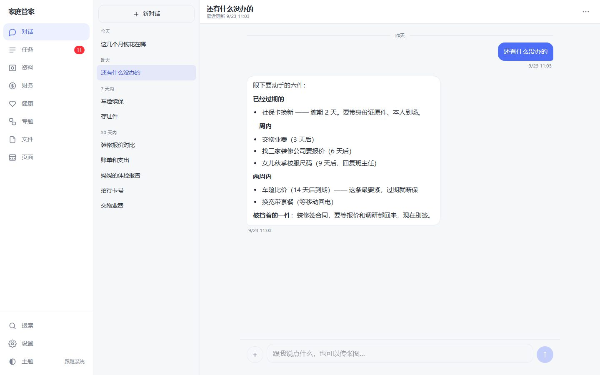
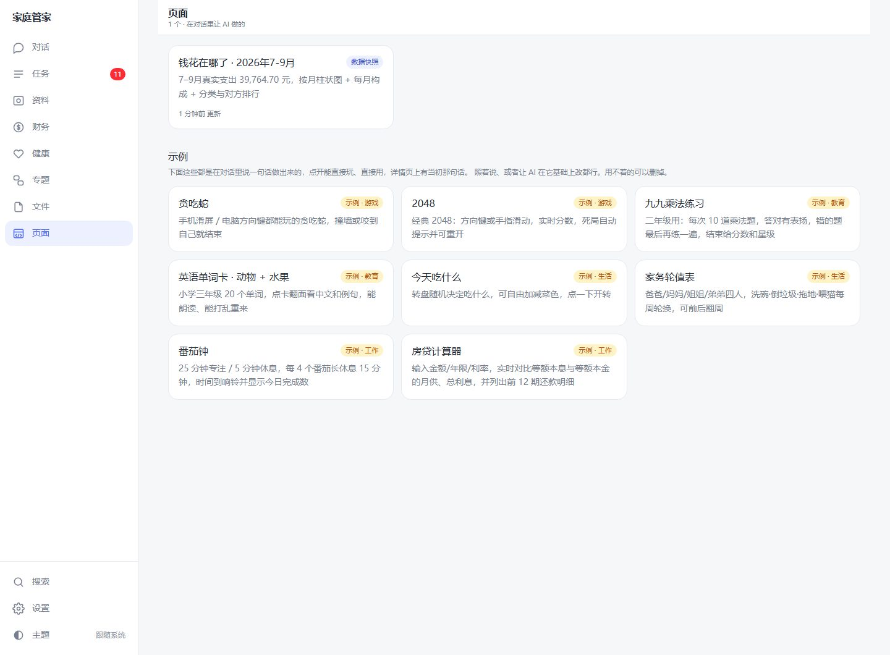
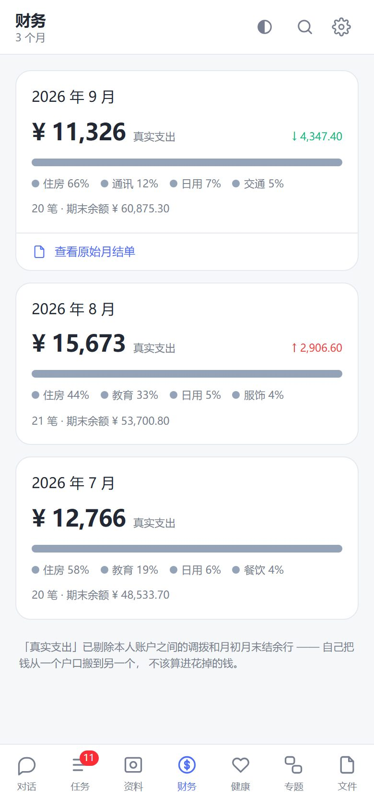

# Personal AI Secretary

[中文](README.md) | **English**

An AI life secretary that runs on your own computer. You tell it things in a chat,
and it files away your to-dos, accounts, bills, medical checkup reports and insurance
policies, so they're right there when you need them.

**All your data stays on your own computer.** No server, no account, no telemetry.
The one exception: when you chat with the AI, what you send goes to the model
provider you chose.

The interface comes in **English and Chinese**. It follows your system language on
first launch; switch any time under **Settings → Language**. In English, the AI
replies in English and saves what it records in English too.

> Still Chinese-only: the 8 bundled sample pages (games and small tools) and the demo
> data. The finance module assumes a single base currency (CNY by default). The
> developer notes and code comments are in Chinese.



## What it does

Talk to it like you'd text a person:

| You say | It does |
| --- | --- |
| "Renew the car insurance before next Wednesday" | Creates a to-do and works out the due date |
| "Remember my bank card number is 6225…" | Saves it to the vault; ask later to look it up, copy with one tap |
| "What's still pending?" | Checks the task list and answers truthfully |
| Drop in a bank statement screenshot | Reads it line by line into the ledger, **reconciles against the opening/closing balance**, and tells you by how much if it misread something |
| Drop in a checkup report | Records each metric in the health archive, flags abnormal ones, shows trends across checkups |
| "Make a page showing where the money went these months" | Queries the real data and builds a chart page, saved under "Pages" |
| "Make a snake game for my kid" | Builds a playable mini game (8 sample pages ship with the app) |
| "Make a reading log with book titles, authors and ratings" | Builds an editable page; records are saved in the local database and remain available when you reopen it or access it from your paired phone |
| "How many books have I read this year?" / "Add Dune to my reading log" | Reads the records saved by the page and queries or updates that same data on your request |

Also:

- **Multiple conversations**: one topic per conversation, auto-titled. The vault, tasks and pages are shared, so every conversation can see them.
- **Insurance ledger**: when each policy's next premium is due.
- **Topics**: an ongoing matter (renovation, buying a car) with its related tasks and a list of "things we haven't figured out yet".
- **Phone access**: pair your phone by QR code on the same Wi-Fi and use it in the mobile browser. Add it to your home screen and it feels like an app.
- **Household members**: tasks can be assigned to different people at home.
- **English / Chinese interface**: switch under Settings → Language.

## Recent page-building improvements (current source)

- **A separate model call for each page**: the chat AI prepares the requirements and real data, then a separate call builds the page with design guidance for reports, games and learning activities. The Bailian and official DeepSeek configurations use `max` reasoning effort to give the model more room to think; this parameter is not forced on other custom providers.
- **Visible progress**: see whether the model is thinking or how much HTML it has written while a complex page is being generated.
- **Pages that remember**: reading logs, habit trackers, lists and game high scores can use built-in storage backed by your local database. The page and the chat AI read and update the same data, so you can ask about your records without copying them into chat.
- **Full-screen view and download**: records can still be saved in the full-screen view. Downloading a single HTML file includes the page's existing data. The downloaded file works independently and does not automatically sync changes back to the app.

<p>


</p>

## Download (Windows)

Grab one from [Releases](../../releases):

> As of 2026-10-08, the latest release is still `v0.2.0` from 2026-09-25. The page-building and persistent-storage improvements above are in the current source, but the downloadable packages have not been updated. To try these improvements now, build from source using the instructions below.

| File | Where your data lives | Best for |
| --- | --- | --- |
| `personal-ai-secretary-Setup-<version>.exe` | `%APPDATA%\家庭管家\data\` | Most people. Install once, get desktop and Start menu shortcuts |
| `personal-ai-secretary-<version>-win.zip` | `data\` inside the unzipped folder | No install. Unzip and run; copy the whole folder to a USB stick to take it with you |
| `personal-ai-secretary-portable-<version>.exe` | `data\` next to the exe | Single-file, no install. Unpacks itself on every launch, so cold start is slow |

Once installed, the app is called "Household Steward" (「家庭管家」 in Chinese).

The installers aren't code-signed, so Windows will say "Windows protected your PC".
Click **More info → Run anyway**. If you'd rather not, build it yourself (see below).

Windows only for now.

## First run

1. **Enter an AI model key.** Menu **Settings → AI model / API key…**, pick a provider, paste the key, click **Save and test**.
   - **Alibaba Cloud Model Studio (Bailian)**: create a key on the "API-KEY" page of the [console](https://bailian.console.aliyun.com/)
   - **DeepSeek**: "API keys" at [platform.deepseek.com](https://platform.deepseek.com/)
   - Any other OpenAI-compatible endpoint works too; fill in the base URL and model name yourself. Reading bills and checkup reports needs a **vision-capable** model.
2. **Settings → Household members**: list who's in your household so tasks can be assigned to them.
3. Go to **Chat** and say something.

It works without a key too: tasks, the vault and so on can all be edited by hand, you just can't chat.

## Privacy

- The database (SQLite), uploaded originals and backups all live in that `data` folder. Menu **Settings → Open data folder** takes you there.
- The app itself sends no telemetry. **Text and images you send in a chat go to your chosen model provider**; the AI has to read a bill to enter it for you. If you don't want the AI to see something, don't send it; enter it by hand.
- Sensitive values are stored **in plain text** in the local database (that's how the AI can look them up). Protection relies on the computer itself: don't hand the `data` folder to anyone.
- Phone access is off by default. When on, only devices paired by QR code can get in. Pairing codes are single-use and expire after 10 minutes, and devices can be removed at any time.

## Build from source

Requires Node.js 22+.

```bash
npm install
cp .env.example .env          # local dev config; the AI key can stay empty and be set in Settings later
npx prisma db push            # create the database
node scripts/seed-demo.mjs    # optional: load demo data
npm run dev                   # http://localhost:3096
```

Build the desktop app:

```bash
cd desktop
npm install
npm run dist                  # → desktop/dist/, installers contain no API key
```

`npm run dist` runs `node scripts/prepare.mjs --no-key` first. ⚠ If you ever run
`prepare.mjs` **without** `--no-key`, the `AI_API_KEY` in `.env` gets baked into the
installer, and anyone who has the installer can extract it.

## Layout

```
src/app/(app)/     Pages: chat, tasks, vault, finance, health, topics, pages, files, settings
src/app/api/chat/  Chat endpoint (AI SDK, OpenAI-compatible)
src/lib/           agent-tools (tools the AI can call), queries, page sandbox, import logic
prisma/            Data model
scripts/           CLI (secretary.mjs), demo data, backups
samples/pages/     The 8 sample pages bundled in "Pages"
desktop/           Electron shell, phone-access gateway (lan.js), packaging scripts
docs/              Developer notes (Chinese)
```

Before changing code, read [`docs/开发笔记.md`](docs/开发笔记.md) and
[`desktop/README.md`](desktop/README.md) (both in Chinese; code comments are in Chinese too).

Planned work: [local Codex integration](docs/Codex接入方案.md) (plan in Chinese; development is deferred, and the existing API backend is retained).

## Status

Early days. The author's own family uses it.

- **The data model will still change.** Upgrades try to add new columns automatically, but don't treat this as your only copy for now; keep important things elsewhere too.
- No auto-update. New versions have to be downloaded and installed over the old one (your data is kept).
- Not done yet: memory across conversations, letting the AI re-read previously uploaded originals, wiring topics and documents into chat.

Issues and suggestions are welcome via [Issues](../../issues). This is a personal
project: I'll read them, but can't promise a quick reply.

## License

[AGPL-3.0](LICENSE). Free to use, modify and redistribute. **If you run a modified
version as a service for others (including as a website), you must publish its
source code too.**
