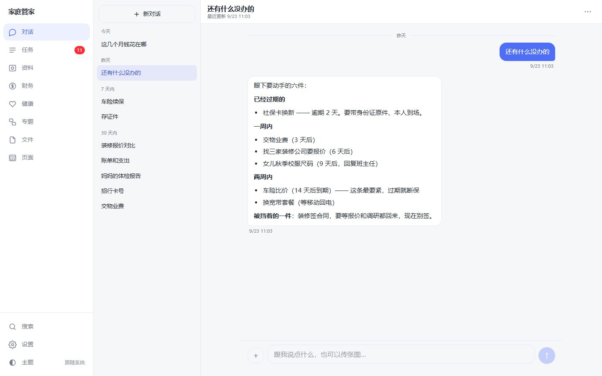
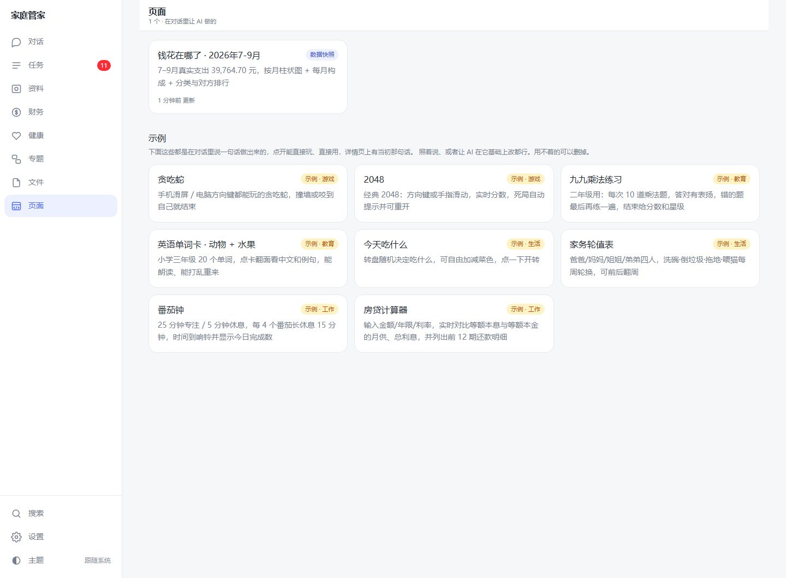
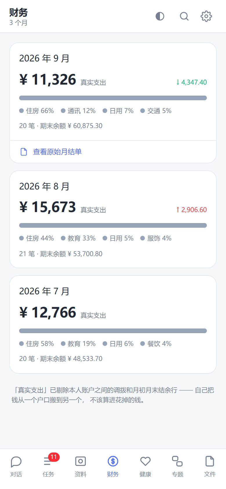

# 个人 AI 秘书（家庭管家）

一个装在自己电脑上的 AI 生活秘书。你用聊天的方式交代事情，它把待办、账号、账单、
体检报告、保单分门别类存好，要用的时候一翻就有。

**数据全部留在你自己的电脑上。** 没有服务器、没有账号、不往任何地方上报 ——
唯一的例外是跟 AI 对话时，你发的内容会传给你自己选的模型服务商。



## 能做什么

直接跟它说话，像发微信：

| 你说 | 它做 |
| --- | --- |
| 「下周三前把车险续了」 | 建一条待办，算好截止日期 |
| 「记住我的招行卡号是 6225…」 | 存进资料库，以后问一句就能查、一键复制 |
| 「还有什么没办的」 | 查任务表，照实回答 |
| 拖一张银行账单截图进来 | 一笔笔读出来入账，**自动核对期初期末余额**，读错了会告诉你差多少 |
| 拖一张体检报告进来 | 指标一项项录进健康档案，异常项标出来，下次体检能看趋势 |
| 「做个页面看看这几个月钱花哪了」 | 查真实数据，做一张图表页面，存在「页面」栏目里 |
| 「做个贪吃蛇给孩子玩」 | 做一个能玩的小游戏（装好就带 8 个示例） |

另外还有：

- **多个对话**：一件事一个对话，聊完自动起标题。资料、任务、页面是共用的，哪个对话里都查得到。
- **保单台账**：每份保单下次交钱是哪天。
- **专题**：一件要持续跟进的事（装修、买车），挂着相关任务和「还没搞清楚的问题」。
- **用手机访问**：同一个 WiFi 下扫码配对，手机浏览器里用，添加到主屏幕就像 App。
- **家里的人**：任务能派给家里不同的人。

<p>


</p>

## 下载安装（Windows）

到 [Releases](../../releases) 下载，两种挑一种：

| 文件 | 数据放在哪 | 适合 |
| --- | --- | --- |
| `家庭管家 Setup <版本>.exe` | `%APPDATA%\家庭管家\data\` | 大多数人。装一次，桌面和开始菜单有图标 |
| `家庭管家-<版本>-win.zip` | 解压目录里的 `data\` | 免安装。解压即用，整个文件夹拷到 U 盘能带走 |

安装包没有代码签名，Windows 会提示「已保护你的电脑」—— 点 **更多信息 → 仍要运行**。
不放心的话可以按下面「从源码构建」自己打包。

目前只有 Windows 版。

## 第一次打开

1. **填 AI 模型的 key**。菜单「设置 → AI 模型 / API Key…」，选服务商、填 key，点「保存并测试」。
   - **阿里云百炼**（国内直连）：[百炼控制台](https://bailian.console.aliyun.com/) 注册后在「API-KEY」页面创建
   - **DeepSeek 官方**：[platform.deepseek.com](https://platform.deepseek.com/) 的「API keys」
   - 其他 OpenAI 兼容接口也行，自己填地址和模型名。读账单、体检报告要用**带视觉**的模型。
2. **设置 → 家里的人**：填上家里有谁，任务就能派给不同的人。
3. 去「对话」里说句话试试。

不填 key 也能用：待办、资料库这些都能手动操作，只是没法对话。

## 隐私

- 数据库（SQLite）、上传的原件、备份都在上面那个 `data` 文件夹里。菜单「设置 → 打开数据文件夹」直接跳过去。
- 软件本身不联网上报。**跟 AI 对话时发的文字和图片会传给你选的模型服务商** —— AI 要读到账单才能帮你录入。不想让它看的东西就别发给它，自己手动录。
- 敏感信息是**明文**存在本机数据库里的（这样 AI 才查得出来）。靠的是这台电脑本身的安全：别把 `data` 文件夹随手发给别人。
- 「用手机访问」默认关。打开后只有扫码配对过的设备能进来，配对码一次性、10 分钟过期，设备可以随时移除。

## 从源码构建

需要 Node.js 22+。

```bash
npm install
cp .env.example .env          # 本地开发配置，AI key 可以留空、之后在设置页填
npx prisma db push            # 建库
node scripts/seed-demo.mjs    # 可选：灌一份演示数据
npm run dev                   # http://localhost:3096
```

打包桌面版：

```bash
cd desktop
npm install
node scripts/prepare.mjs --no-key     # 构建 Next standalone、生成空模板库
npx electron-builder --win --x64      # 产物在 desktop/dist/
```

⚠ **一定带 `--no-key`**。不带的话 `.env` 里的 `AI_API_KEY` 会被打进安装包，
拿到安装包的人能把它抠出来。

## 目录

```
src/app/(app)/     各个页面：对话、任务、资料、财务、健康、专题、页面、文件、设置
src/app/api/chat/  对话接口（AI SDK，OpenAI 兼容）
src/lib/           agent-tools（AI 能调的工具）、数据查询、页面沙箱、导入逻辑
prisma/            数据模型
scripts/           命令行工具（secretary.mjs）、演示数据、备份
samples/pages/     「页面」栏目自带的 8 个示例
desktop/           Electron 外壳、手机访问网关（lan.js）、打包脚本
docs/              开发笔记
```

想改代码先看 [`docs/开发笔记.md`](docs/开发笔记.md) 和 [`desktop/README.md`](desktop/README.md)。

## 现状

早期版本，作者自己家在用。

- **数据结构还会变**。升级时会尽量自动补上新字段，但暂时别把它当唯一的存档 —— 重要的东西另外留一份。
- 没有自动更新，新版本要重新下载安装（覆盖装，数据不丢）。
- 还没做：跨对话的记忆、事后让 AI 重看上传过的原件、专题和文稿接进对话。

问题和建议欢迎提 [Issue](../../issues)。这是个人项目，会看，但不保证及时回复。

## 许可证

[AGPL-3.0](LICENSE)。可以自由使用、修改、分发；**修改后的版本如果拿来对外提供服务
（包括做成网站给别人用），必须同样公开源代码。**
